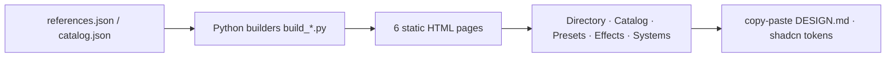

[한국어](README.md) | **English**

# Vibe Design Studio (VDS)
> A design-system studio for vibe coders — copy-paste DESIGN.md and shadcn tokens.


[](https://ljhljh0703-cmd.github.io/VDS/)

## The problem
When you build with AI ("vibe coding"), the weakest link is handing the agent a precise tone and design system. Saying "make it clean" doesn't transfer. VDS turns scattered design inspiration into **copy-paste DESIGN.md and shadcn tokens** that you can feed straight into Cursor, Claude Code, or v0 — packaged as a static studio.

## What makes it different
- **A directory of 38 design systems** — each card links to the official docs and ships a copy-paste **DESIGN.md** (Google Stitch format) plus **shadcn/ui CSS variables**. Colors and type carry an observation-based `[approx]` label.
- **Live catalog** — 77 HTML/design techniques · 33 style presets · 66 live effects · 53 real-site systems, compared and copied on one screen.
- **Self-contained · honest labeling** — every page is a single HTML file (Google Fonts only), light/dark, with observed-vs-approximate clearly marked. Always confirm exact values via the official link.

## Architecture

Flow: data (JSON) → Python builders → 6 self-contained HTML pages → copy DESIGN.md / shadcn from each card.

## Tech stack
| Area | Used |
|---|---|
| Front / UI | Single-file HTML · CSS (tokens, light/dark) · vanilla JS — zero framework |
| Builders | Python 3 (`build_catalog.py` · `build_references.py`) → JSON→HTML |
| Fonts | Google Fonts (IBM Plex Sans KR · Noto Serif KR · JetBrains Mono) — the only external dependency |
| Output tokens | shadcn/ui CSS variables · Google Stitch DESIGN.md |

## Run it
```bash
# Static site — no build needed, just open
open index.html        # or design-studio.html

# Regenerate after adding data (optional)
python3 _publish/build_catalog.py      # technique catalog
python3 _publish/build_references.py   # design-system directory
```
GitHub Pages: Settings → Pages → serving from branch root (`/`) makes `index.html` the landing page.

## Honesty · limits
- **[approx]** — each site's colors, type, and shadcn tokens are an **observation-based approximation** of public pages. Confirm exact values via the official link on the card.
- **clean-room** — third-party trademarks and designs belong to their owners. VDS does not redistribute assets; it only **links** to official docs.
- **A curated 38** — this is a selection, not an exhaustive index. The larger canonical directory (356+) inspired the format: oh-my-design.kr (MIT).
- Roadmap: expand the directory · finer collections · second-pass cleanup of presets/effects.

## Screenshots / demo
`docs/screenshot-*.png` placeholder — author capture pending. Live: https://ljhljh0703-cmd.github.io/VDS/

## License
MIT
