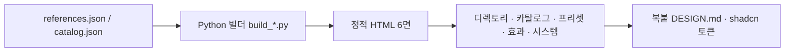

**한국어** | [English](README.en.md)

# Vibe Design Studio (VDS)
> 바이브 코더를 위한 디자인 시스템 스튜디오 — 복붙 DESIGN.md·shadcn 토큰.


[](https://ljhljh0703-cmd.github.io/VDS/)

## 문제 정의
AI로 코딩할 때(바이브 코딩) 가장 약한 고리는 "어떤 톤·디자인 시스템으로 만들지"를 에이전트에 정확히 넘기는 일이다. 말로 "깔끔하게"는 전달되지 않는다. VDS는 흩어진 디자인 영감을 **복붙 가능한 DESIGN.md와 shadcn 토큰**으로 떠서, Cursor·Claude Code·v0에 그대로 먹이도록 정리한 정적 스튜디오다.

## 핵심 차별축
- **디자인 시스템 디렉토리 38선** — 카드마다 공식 문서 직링크 + Google Stitch 형식 **DESIGN.md**와 **shadcn/ui CSS 변수** 복붙 블록. 색·타이포는 관측 기반 `[근사]` 라벨.
- **라이브 카탈로그** — HTML·디자인 기법 **77종** · 스타일 프리셋 **33종** · 라이브 효과 **66종** · 실사이트 시스템 **53종**을 같은 화면에서 비교·복사.
- **self-contained · 정직 라벨** — 전 페이지 단일 HTML(Google Fonts만), 라이트/다크, 관측/근사 구분 표기. 정확값은 항상 공식 링크로 확인.

## 아키텍처

흐름: 데이터(JSON) → 파이썬 빌더 → self-contained HTML 6면 → 카드에서 DESIGN.md·shadcn 복붙.

## 기술 스택
| 영역 | 사용 |
|---|---|
| 프론트 / UI | 단일 파일 HTML · CSS(토큰·라이트/다크) · 바닐라 JS — 프레임워크 0 |
| 빌더 | Python 3 (`build_catalog.py` · `build_references.py`) → JSON→HTML |
| 폰트 | Google Fonts(IBM Plex Sans KR · Noto Serif KR · JetBrains Mono) — 유일한 외부 의존 |
| 산출 토큰 | shadcn/ui CSS 변수 · Google Stitch DESIGN.md |

## 실행법
```bash
# 정적 사이트 — 빌드 불필요, 그냥 열기
open index.html        # 또는 design-studio.html

# 데이터 추가 후 재생성(선택)
python3 _publish/build_catalog.py      # 기법 카탈로그
python3 _publish/build_references.py   # 디자인 시스템 디렉토리
```
GitHub Pages: repo Settings → Pages → branch root(`/`) 서빙 시 `index.html`이 랜딩이 된다.

## 정직 · 한계
- **[근사]** — 각 사이트의 색·타이포·shadcn 토큰은 공개 페이지 **관측 기반 근사**다. 정확값은 카드의 공식 링크로 확인.
- **clean-room** — 외부 브랜드의 상표·디자인은 각 권리자 소유다. VDS는 자산을 재배포하지 않고 공식 문서로 **링크**만 한다.
- **큐레이션 38선** — 전수가 아니라 선별이다. 더 큰 정본 디렉토리(356+)는 oh-my-design.kr(MIT)에서 영감을 받았다.
- 다음(로드맵): 디렉토리 확장 · 컬렉션 세분화 · 프리셋/효과 2차 정리.

## 스크린샷 / 데모
`docs/screenshot-*.png` 자리 — 작가 캡처 예정. 라이브: https://ljhljh0703-cmd.github.io/VDS/

## License
MIT
